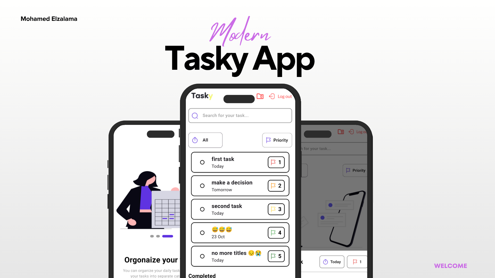
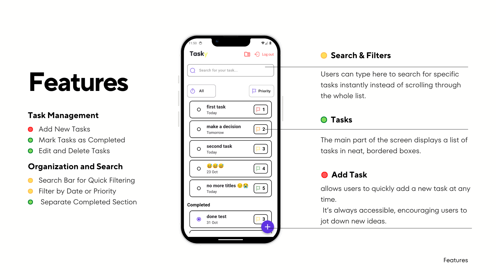
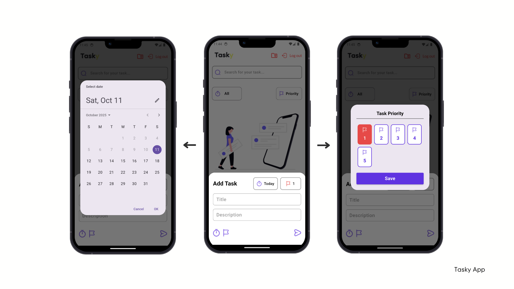
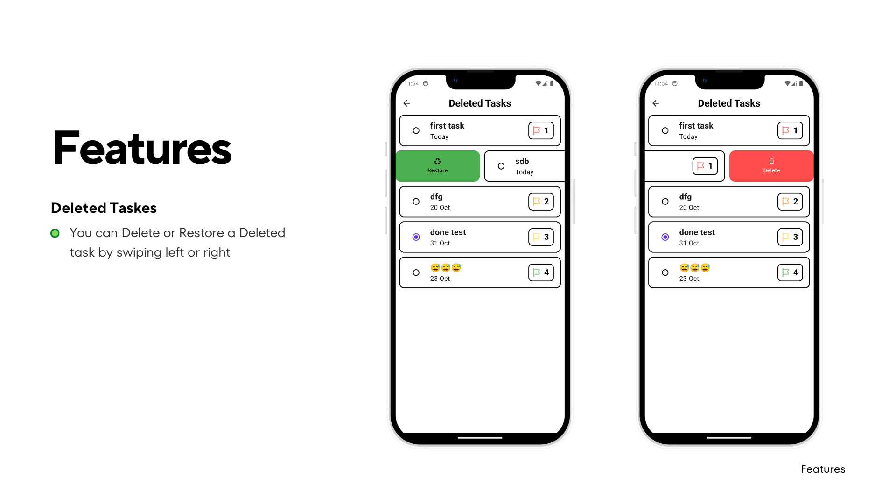
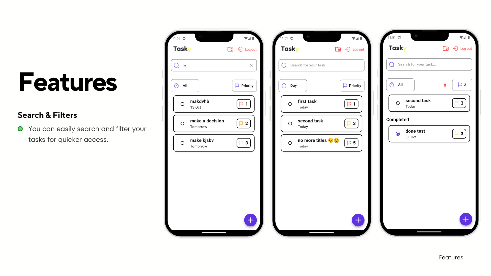

<!DOCTYPE html>
<html>
<body>
     <h1 align="center">
       ( Tasky App )
    </h1>
    
    

        • <a href="#key-features">Key Features</a>
        • <a href="#tech-stack">Tech Stack & Tools</a>
        • <a href="#how-it-works">How To Use</a>    
        • <a href="#installation">Installation & Setup</a>
        
 

    
 
 
 
 
 
 
 
   
    
 <h2 id="key-features">📌 Key Features</h2>
    <ul>
        <li><strong>Real-Time Weather Data:</strong> Temperature, humidity, wind speed, visibility.</li>
        <li><strong>Hourly & 5-Day Forecast:</strong> View upcoming weather conditions.</li>
        <li><strong>Search & Multiple Locations:</strong> Find weather for different cities.</li>
        <li><strong>Offline Access:</strong> Stores weather data using Room Database.</li>
        <li><strong>Animations:</strong> Smooth UI interactions with Lottie & MotionLayout.</li>
    </ul>
    
<h2 id="tech-stack">🛠 Tech Stack & Tools</h2>
    <ul>
        <li><strong>Development:</strong> Kotlin, Android Studio, Jetpack Compose/XML</li>
        <li><strong>Networking:</strong> Retrofit + Gson</li>
        <li><strong>Storage:</strong> Room Database, DataStore, Shared Preference</li>
        <li><strong>Location Services:</strong> FusedLocationProviderClient</li>
        <li><strong>Widget:</strong> Glance Widget</li>
        <li><strong>Notifications:</strong> Work Manager</li>
    </ul>
    
<h2 id="how-it-works">🛠 How It Works</h2>
    <ol>
        <li><strong>Launch the App:</strong> Fetches current location & weather.</li>
        <li><strong>View Weather Details:</strong> Displays temperature, wind speed, and humidity.</li>
        <li><strong>Check Forecast:</strong> Hourly & 5-day updates.</li>
        <li><strong>Search Locations:</strong> Enter a city name for weather info.</li>
        <li><strong>Toggle Units:</strong> Switch between °C & °F.</li>
    </ol>
    
  <h2 id="installation">🚀 Installation & Setup</h2>
    <ol>
        <li>Clone this repository: <code>git clone https://github.com/MohamedKamel3/Tasky.git</code></li>
        <li>Run the project on an emulator or physical device.</li>
    </ol>
    
</body>
</html>
