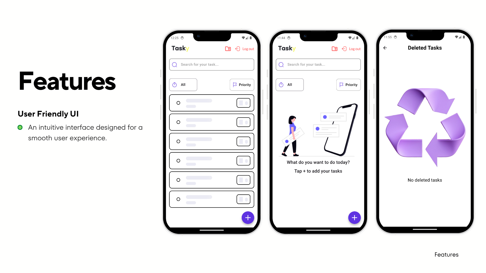

<!DOCTYPE html>
<html>
<body>
     <h1 align="center">
       ( Tasky App )
    </h1>
    
    

        • <a href="#key-features">Key Features</a>
        • <a href="#tech-stack">Tech Stack & Tools</a>
        • <a href="#how-it-works">How To Use</a>    
        • <a href="#installation">Installation & Setup</a>
        
 

    
 
 
 
 
 
 
 
   
<h2 id="key-features">📌 Key Features</h2>
    <ul>
        <li><strong>Task Management:</strong> Create, edit, delete, and mark tasks as completed. Tasks include title, description, due date, and priority levels (1-5).</li>
        <li><strong>Search & Filters:</strong> Quickly search for tasks using the search bar. Filter tasks by priority, date (e.g., All, Day), or view completed tasks in a separate section.</li>
        <li><strong>Deleted Tasks Bin:</strong> View deleted tasks in a dedicated screen. Swipe left to permanently delete or right to restore tasks.</li>
        <li><strong>Calendar Integration:</strong> Select due dates using a built-in calendar picker for easy scheduling.</li>
        <li><strong>Priority System:</strong> Assign priorities to tasks with color-coded indicators for quick visual reference.</li>
        <li><strong>User-Friendly UI:</strong> Intuitive design with smooth interactions, empty state illustrations, and accessible add task button.</li>
        <li><strong>Authentication:</strong> Includes a logout feature, suggesting user account management.</li>
        <li><strong>Empty States:</strong> Helpful messages and illustrations for no tasks or no deleted tasks scenarios.</li>
    </ul>
    
<h2 id="tech-stack">🛠 Tech Stack & Tools</h2>
    <ul>
        <li><strong>Development:</strong> Flutter, MVVM architecture, Clean architecture, State Management (Bloc), Micro Service architecture.</li>
        <li><strong>Storage:</strong> Firebase Fire store.</li>
    </ul>
    
<h2 id="how-it-works">🛠 How It Works</h2>
    <ol>
        <li><strong>Launch the App:</strong> Users are greeted with the main task list screen, showing active tasks, a search bar, filters, and a floating add button.</li>
        <li><strong>Add a Task:</strong> Tap the "+" button to open the add task popup. Enter title, description, select due date via calendar, and set priority.</li>
        <li><strong>Manage Tasks:</strong> Swipe on tasks to edit or delete. Mark as completed with checkboxes. View completed tasks separately.</li>
        <li><strong>Search and Filter:</strong> Use the search bar for keyword search. Apply filters like "Priority" or "Day" to narrow down the list.</li>
        <li><strong>Deleted Tasks:</strong> Access the deleted tasks screen to restore or permanently delete items via swipes.</li>
        <li><strong>Logout:</strong> Use the logout button for session management.</li>
    </ol>
    
  <h2 id="installation">🚀 Installation & Setup</h2>
    <ol>
        <li>Clone this repository: <code>git clone https://github.com/MohamedElzalama/Tasky.git</code></li>
        <li>Run the project on a simulator or physical device.</li>
    </ol>
    
</body>
</html>
